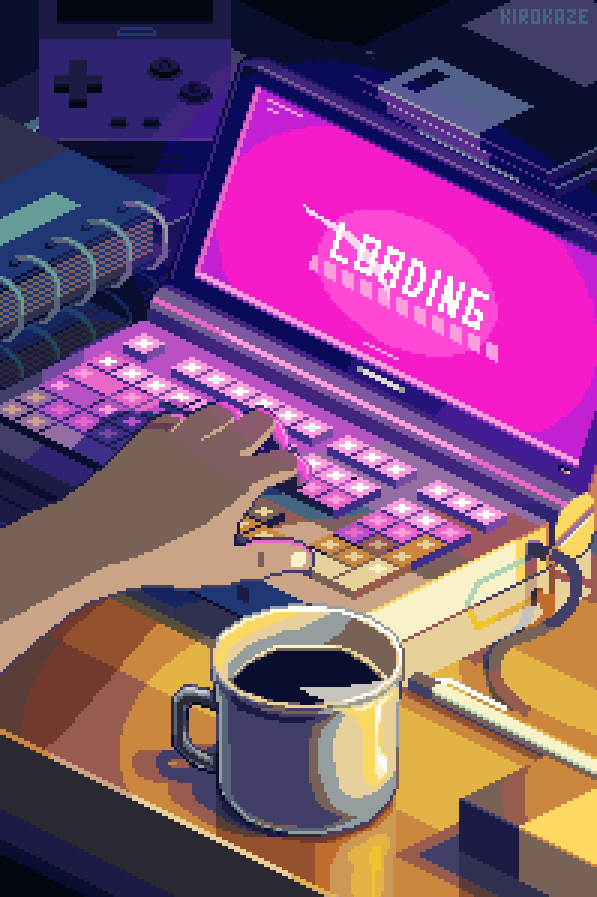

#

 

  
  
 

    
 

  
      <h2 align="center"><strong>Tecnologias</h2>
 

   
   
   
   
 

  
      <h2 align="center">Redes Sociais</h2>
 

 
 
 

 <h2 align="left"><strong></h2>

 
  
 

   
  

